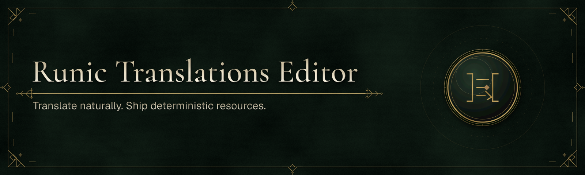

# Runic Translations Editor

Translate and review the same MessageFormat 2 project that application builds consume. Browse locale coverage, search messages, edit patterns and variables, preview changes, manage review state, and resolve compiler feedback in one place while keeping ordinary `.mf2` files readable in Git and any text editor.

Runic Translations Editor is a companion to [Runic Translations](../../packages/dotnet/Runic.Translations/README.md). The editor manages workspaces; the compiler, schema, runtime, CLI, and language integrations are published by the SDK.

See the [editor architecture](docs/architecture.md), [source-build and future
archive guidance](docs/editor-distribution.md), and [usability-study protocol](docs/translator-usability-test.md).

## Availability and local commands

Standalone Editor distributions are outside the SDK preview. Build the editor from
source using the commands below. The examples here use the executable produced by
that build; SDK package publication does not imply an Editor download.

Open the directory containing `translations/runic.json`, or the translations
directory itself. The editor uses the same compiler path as MSBuild and Vite.
After building from source, use the launch command below with
`validate /path/to/workspace` for compiler-backed
validation: exit codes are `0` for valid, `1` for diagnostics or a missing project,
and `2` when validation cannot start.

## Headless interchange

Use `export` to write XLIFF or portable review JSON. Use `report` to inspect an import's reviewable diff and refusals without changing the workspace. An XLIFF import updates only the target project's declared translation resources. An import is applied only when `--apply` is explicit; it previews and consumes the confirmation within one process, so no confirmation token is persisted or reusable.

```bash
./runic-translations-editor export /path/to/workspace --format xliff --output .runic-translations/export
./runic-translations-editor report /path/to/workspace --format xliff --source .runic-translations/export/catalog.en.xliff
./runic-translations-editor import /path/to/workspace --format xliff --source .runic-translations/export/catalog.en.xliff --apply

./runic-translations-editor export /path/to/workspace --format review --output .runic-translations/export/catalog.review.json
./runic-translations-editor report /path/to/workspace --format review --source .runic-translations/export/catalog.review.json
```

`--output` belongs to `export`; select the command response envelope with `--runic-output json` (or `RUNIC_COMMANDLINE_OUTPUT=json`). An XLIFF import updates only the selected project's declared `.mf2` or `.rmf2` translation resources. A report or import that is refused returns exit code `1` and lists its refusal codes in both human output and the JSON fault details.

## Local support diagnostics

Run `diagnostics <workspace>` to create the existing privacy-bounded diagnostic ZIP for an explicit local support collection. The command never uploads it. Use `dotnet runic support --mode preview|collect|remove --editor-diagnostics <zip> --destination <path>` to inspect, collect, or remove a local unsigned support envelope. The editor stores preferences, recents, and recovery drafts in one native per-user record, not a browser profile; it is atomically replaced and an unreadable record is quarantined on next launch. In the editor’s **About & diagnostics** panel, **Local editor state** reports only entry counts and bytes; use **Clear local state** to remove those records without changing workspace files or current in-memory work.

## What it supports

The editor opens conventional `runic.json` projects, validates and saves their
MF2 messages, watches external changes, and previews through the canonical
compiler model. Diagnostics remain privacy-bounded and writes use revision
checks plus atomic replacement.

The editor uses the RMF2 v5 compiler/runtime pipeline without fabricating a
retired catalog carrier. Previews are formatted by the verified .NET artifact/pack
path; the browser receives validated inert semantic runs and never approximates
AST 5 in JavaScript. Editor refactors and XLIFF imports are resource-only: they
do not rewrite application call sites.
The closed XLIFF 2.1 profile deterministically round-trips direct plain-text
RMF2 resources, reports structured messages as semantic loss, and refuses
structured imports instead of flattening them.

Machine-translation providers and signed stable distribution are not available yet.

## Build from source

Use the locked Translations SDK toolchain and run these commands from this
repository's root. On NixOS, inspect `.envrc` and `flake.nix`, allow the environment,
then use `direnv exec .` as shown:

```sh
direnv allow
direnv exec . bun run bootstrap
direnv exec . bun run build
nix develop .#editor -c dotnet run --project apps/translations-editor/Runic.Translations.Editor.csproj \
  --configuration Release --no-build -- edit /path/to/workspace
```

`bun run build` produces the Release editor and its packaged frontend. Replace
`edit /path/to/workspace` with `validate /path/to/workspace` for a headless first-run
check, or with `--help` to inspect the supported commands. The `dotnet run` command
also launches on Windows or macOS with the corresponding .NET, Node, and Bun
toolchain available; native UI launch requires the platform's windowing runtime.
The default `direnv` shell supplies the build and CLI toolchain. The optional
`nix develop .#editor` shell adds Chromium, GTK 3/WebKitGTK 4.1, GIO/TLS modules,
and GStreamer from this repository's locked nixpkgs; it sets `WEBUI_BROWSER_PATH`
for hosted browser acceptance. It does not require another repository's shell.
`edit` opens an installed browser in app mode; add `--webview` to request the
embedded WebView instead. On Linux, interactive launch needs a running X11 or
Wayland desktop session; native chooser services also need that session's D-Bus
and configured XDG portal backend. The shell supplies tools and libraries without
starting those services or selecting the session's backend.

On Linux without Nix, provide a supported Chromium browser for normal `edit`,
GTK 3 and WebKitGTK 4.1 for `--webview`, and the session services above. For the
hosted acceptance harness, explicitly set `WEBUI_BROWSER_PATH` to your browser's
executable. The [hosted acceptance guide](tests/HostedBrowserE2E/README.md) explains
the reproducible Nix workflow. Headless browser acceptance and editor smoke tests
exercise application behavior; they do not certify interactive Linux desktop
launch, embedded WebView, or native chooser behavior.

The shell examples elsewhere on this page use the standalone launcher's name;
when running from source, pass those arguments after the `--` above.

Translations dependencies resolve from source in this repository. Runic Command
Line, Application, Platform, and the editor's Application web adapters resolve
from independently pinned published packages. No sibling SDK checkout is needed.
The native transport is pinned to published `CsWebUi` and `CsWebUi.Native`
`2.5.0-beta.4.6`, including the UTF-8 response fix and refreshed official native
libraries. These resolve through the repository's ordinary NuGet.org configuration.
`bun run test` checks the frontend, generated Views client, editor save/recovery smoke and example workspace.
`bun run verify-packages` checks the SDK's isolated package consumers. See the
[contributor guide](../../CONTRIBUTING.md) for the complete verification sequence.

For frontend-only development, build once to generate the localized ESM module,
then run this from the SDK root:

```sh
RUNIC_TRANSLATIONS_MANIFEST="$PWD/apps/translations-editor/obj/Release/net10.0/translations/editor.esm-v5/web-module-manifest-v3.json" \
  direnv exec . bun run --cwd apps/translations-editor/Frontend dev:mock
```

Mock mode keeps writes in memory.

## Support and license

Report reproducible editor problems through [GitHub Issues](https://github.com/Runic-Artifex/runic-translations-sdk/issues). Please include your platform, source revision and `--version` output, and safe-to-share validation output; do not include translation text or workspace paths in public reports.

Runic Translations Editor is released under the [MIT License](../../LICENSE). See [third-party notices](THIRD-PARTY-NOTICES.md) for bundled dependency notices.
